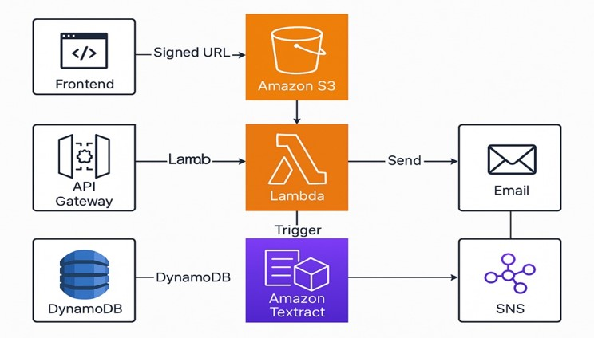
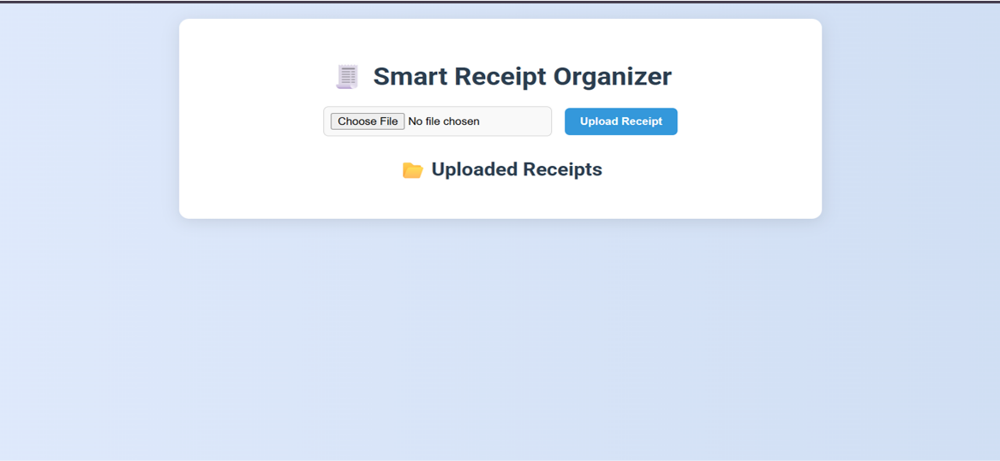
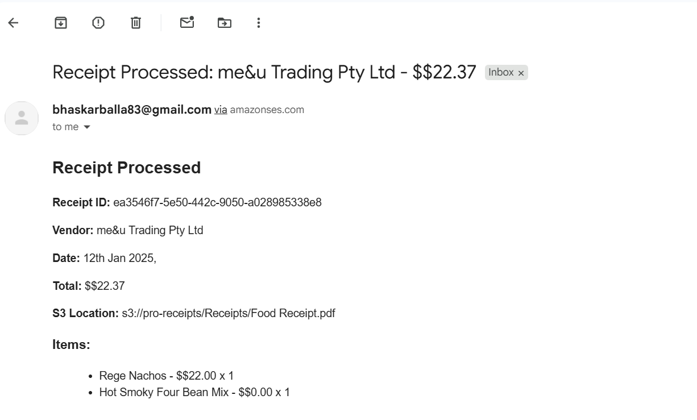

# Smart Receipt Organizer using AWS

**Automating receipt extraction and notifications using Textract and SNS**

## ✅ Overview

This project, **Smart Receipt Organizer using AWS**, leverages a fully serverless, event-driven architecture on AWS to automate the process of receipt data extraction, storage, and notification. Built for scalability and simplicity, the system allows users to upload receipt PDFs via a secure frontend, extracts structured data using Amazon Textract, stores it in DynamoDB, and sends real-time summaries via Amazon SNS.

## Project Structure

```bash
smart-receipt-organizer/
│
├── frontend/                   # HTML/JS client to upload receipts
│   └── index.html              # Web UI to upload receipts
│
├── backend/
│   ├── generateSignedUrl.js    # Lambda to return signed S3 upload URL
│   └── processReceipt.js       # Lambda to process uploaded PDFs using Textract
│
├── infrastructure/
│   └── s3-bucket.yaml          # Optional: IaC templates (CDK/CloudFormation)
│
├── README.md
└── architecture.png            # Visual of system architecture (optional)
```

## Features

- 📤 **Secure PDF upload** via signed S3 URLs
- 🧠 **Automated data extraction** using Textract AnalyzeExpense API
- 🗃️ **DynamoDB storage** of structured metadata
- 📧 **Real-time email summaries** via SNS
- ☁️ **100% Serverless** with AWS Lambda
- 🔒 Fine-grained IAM and S3 access control

## Architecture




## Workflow

1. **User Interface**: A lightweight HTML/JS form allows users to upload receipt PDFs.
2. **API Gateway**: Routes the signed URL request to `generateSignedUrl.js` Lambda.
3. **S3 Upload**: The receipt is uploaded directly to S3 via the signed URL.
4. **Lambda Trigger**: `processReceipt.js` is triggered via S3 `ObjectCreated` event.
5. **Data Extraction**:
   - Uses Amazon Textract's `AnalyzeExpense` API for key-value pair extraction.
6. **Persistence**:
   - Parsed data is stored in a DynamoDB table.
7. **Notification**:
   - SNS publishes a structured summary to the user’s email.

## Security & Permissions

| Resource       | IAM Permissions                            |
|----------------|---------------------------------------------|
| S3 Bucket      | `s3:PutObject`, `s3:GetObject` (Lambda-only) |
| Lambda (URL)   | `s3:PutObject`, `logs:*`                    |
| Lambda (Process) | `s3:GetObject`, `textract:*`, `dynamodb:PutItem`, `sns:Publish` |
| DynamoDB Table | `PutItem`, `Scan`                          |
| SNS Topic      | `Publish` (Lambda), `Subscribe` (Email)    |

## Lambda Functions

### `generateSignedUrl.js`
- Generates and returns a secure S3 signed URL for the client to upload the receipt.
- Reduces backend load by avoiding file handling in Lambda.

### `processReceipt.js`
- Triggered by S3 upload.
- Uses Textract to extract data.
- Saves extracted metadata to DynamoDB.
- Sends summary via Amazon SNS email.

## Tech Stack

| Layer         | Service             |
|---------------|----------------------|
| UI            | HTML, JavaScript     |
| Compute       | AWS Lambda           |
| API Gateway   | AWS API Gateway      |
| Storage       | Amazon S3            |
| OCR           | Amazon Textract      |
| Database      | Amazon DynamoDB      |
| Messaging     | Amazon SNS           |
| Security      | IAM Roles & Policies |

## Future Enhancements

- 🔐 Add **Cognito authentication** for user login & session management
- 📊 **Receipt Dashboard** for filtering, visualization, CSV export
- 🖼️ Support for **image-based receipts** (JPG/PNG)
- 👥 Multi-user support with tagging & categorization
- 💰 **Cost Analyzer**: Monthly expense summaries & trends

## ScreenShots

### Upload Interface


### Email Summary


## Getting Started

> This assumes you're familiar with AWS Lambda, API Gateway, S3, and IAM.

1. **Frontend Setup**
   - Clone this repo
   - Open `frontend/index.html` in your browser

2. **Deploy Backend Functions**
   - Use the AWS Console or SAM/CDK to deploy:
     - `generateSignedUrl.js`
     - `processReceipt.js`
   - Set appropriate IAM roles and S3 triggers

3. **Configure API Gateway**
   - Create a REST API to route signed URL requests to `generateSignedUrl.js`

4. **Create SNS Topic and Subscribe Email**

5. **Create DynamoDB Table**
   - With primary key `receipt_id` or appropriate schema


